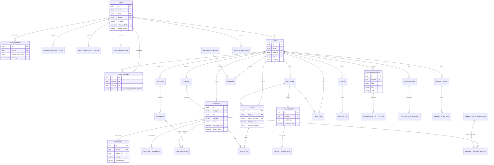

# Kirana OS — Database Architecture & Documentation

## 1. Architectural Principles

DukaanPulse (Kirana OS) is a production-grade, multi-tenant digital operating system for Indian Kirana and neighborhood retail store management.

The system is built on a clear separation of concerns:

- **PostgreSQL 16+**: The single, authoritative **SOURCE OF TRUTH** for factual business records (users, sessions, tokens, products, inventory, sales receipts, Khata ledgers, supplier purchases, expenses, complaints, and audit logs).
- **Hindsight**: The future long-term AI memory layer that retains shopkeeper preferences, past decisions, contextual habits, and recommendation feedback.
- **Python ML/Analytics Engine**: The future statistical service for demand forecasting, reorder point calculation, and price elasticity modelling.
- **LLM / Gemini Agent**: The future conversational and reasoning intelligence layer that synthesizes business context and generates actionable recommendations.

---

## 2. Authentication & Authorization Architecture

### 2.1 Authentication ("Who is the User?")
Canonical user accounts are stored in the `users` table:
- Password hashes use Argon2id or bcrypt. Plaintext passwords and secrets are **never** stored.
- Authentication sessions (`user_sessions`) use hashed session tokens with strict expiration and IP/User-Agent tracking.
- Password reset tokens (`password_reset_tokens`) and email verification tokens (`email_verification_tokens`) are single-use and hashed.
- Phone OTPs (`otp_verifications`) support `SIGNUP`, `LOGIN`, `PASSWORD_RESET`, and `PHONE_VERIFICATION` with attempt tracking and expiration.

### 2.2 Authorization ("What Shop can the User access?")
Multi-tenancy and permissions follow a strict RBAC model:

```
User (System Account)
  ↓
ShopMember (Role: OWNER | MANAGER | STAFF)
  ↓
Shop (Business Account)
  ↓
Shop Specific Business Records (Products, Inventory, Sales, Khata, Expenses)
```

- A user may belong to multiple shops through `shop_members`.
- Access permissions depend on the user's role in the active shop (`OWNER`, `MANAGER`, `STAFF`).
- Every shop-specific table contains a `shop_id` foreign key. All queries are strictly scoped by `shop_id` to guarantee tenant data isolation.

---

## 3. Entity Relationship Diagram (Mermaid)



---

## 4. Key Security & Data Integrity Controls

1. **Monetary Precision**: All financial fields (`price`, `total`, `subtotal`, `amount`, `balance`) use PostgreSQL `DECIMAL(12, 2)`. Floating-point numbers are strictly prohibited.
2. **Quantity Precision**: Inventory quantities use `DECIMAL(12, 3)` to accommodate fractional units (e.g., 2.500 kg).
3. **Auditability**: `inventory_movements` provides an append-only ledger for all stock additions (`PURCHASE`), deductions (`SALE`), damages (`DAMAGE`), and adjustments (`ADJUSTMENT_IN`, `ADJUSTMENT_OUT`).
4. **Soft Protection**: Financial history records (sales, purchases, khata transactions) are never physically deleted. Customer and product deletion is handled via `is_active = false`.
